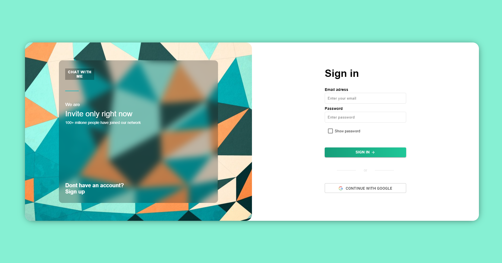
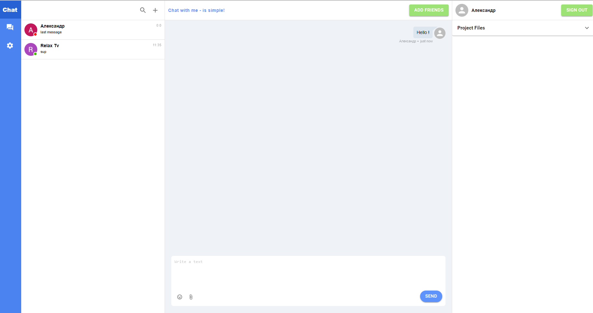

<h3 align="center">Real time chat application</h3>


<!-- ABOUT THE PROJECT -->
## About The Project




This is a real time chat application. You can register/login to enter the application. Registration and authentication is carred out with JWT token. In app you can find the users and add him to the dialogues window. All users, dialogues and messages are saved in Mongo DB. Some functionality has not yet been implemented, but will be added in the near future. Functionality that works: registration, login, google auth, finding users, dialogue creation, messaging.


### Built With

* [React](https://reactjs.org/)
* [Material UI](https://material-ui.com/)
* [Redux](https://redux.js.org/)
* [Node.js](https://nodejs.org/en/)
* [Express](https://expressjs.com/)
* [MongoDB](https://www.mongodb.com/)
* [Socket.io](https://socket.io/)
* [Firebase auth](https://firebase.google.com/docs/auth/web/start)


<!-- GETTING STARTED -->
## Getting Started

To get a local copy up and running follow these simple steps.


### Installation

1. Clone the repo
   ```sh
   git clone https://github.com/alex-borovikov/project_chat__react-node.git
   ```
2. Go to client folder
   ```sh
   npm install
   ```
   
3. Start dev server
   ```sh
   npm start
   ```

3. Go to server folder
   ```sh
   npm install
   ```

3. Start server
   ```sh
   npm run dev
   ```


<!-- CONTACT -->
## Contact

Alex Borovykov - [@ozerov.live](https://instagram.com/ozerov.live) - alex.borrovikov@gmail.com


